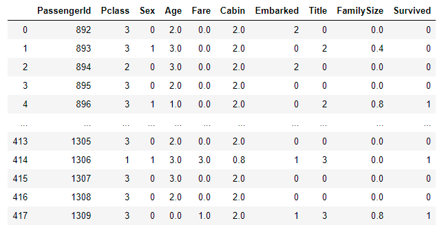
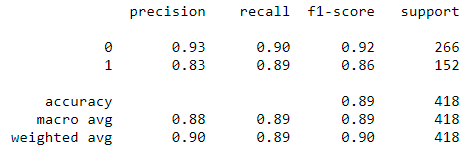

# Titanic_Kaggle

### Predict survival on the Titanic
Complete the analysis of what sorts of people were likely to survive. 
In particular, we ask you to apply the tools of machine learning to predict which passengers survived the Titanic tragedy.

<li>Defining the problem statement</li>
<li>Collecting the data</li>
<li>Exploratory data analysis</li>
<li>Feature engineering</li>
<li>Feature selection</li>
<li>Modeling</li>
<li>Testing</li>
 

#### Data Dictionary
<li>Survived: 0 = No, 1 = Yes</li>
<li>pclass: Ticket class 1 = 1st, 2 = 2nd, 3 = 3rd</li>
<li>sibsp: # of siblings / spouses aboard the Titanic</li>
<li>parch: # of parents / children aboard the Titanic</li>
<li>ticket: Ticket number</li>
<li>cabin: Cabin number</li>
<li>embarked: Port of Embarkation C = Cherbourg, Q = Queenstown, S = Southampton</li>

#### 4. Feature engineering
Feature engineering is the process of using domain knowledge of the data
to create features (feature vectors) that make machine learning algorithms work. 
Feature vector is an n-dimensional vector of numerical features that represent some object.
Many algorithms in machine learning require a numerical representation of object

### Modelling Clustering KNN

### Result

