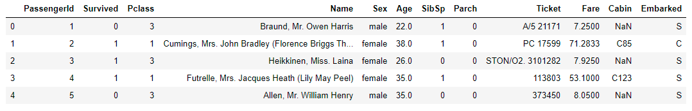

# Titanic_Kaggle

### Abstract
The Titanic was a British ferry that sank in the North Atlantic Ocean on 15 April 1912 after hitting an iceberg on its maiden voyage from Southampton, England to New York City. Titanic has complete facilities but didn't have enough lifeboats to accommodate all the passengers on board. Titanic only carried lifeboats that could accommodate 1.178 passengers, which is 30% of the total passengers and crew. Analyze this incident to understand what factors could have contribute to the survival of some passengers and the death of others. The data consist of 891 train data and 418 test data. The purpose of this project is to determine relationship between factors such as age, gender, passengers class, ticket fare, etc. KNN algorithms will be implemented to predict passengers survival and the percentage of accuracy in the test data set. 

### Predict survival on the Titanic
Complete the analysis of what sorts of people were likely to survive. In particular, we ask you to apply the tools of machine learning to predict which passengers survived the Titanic tragedy.

<li>Defining the problem statement</li>
<li>Collecting the data</li>
<li>Exploratory data analysis</li>
<li>Feature engineering</li>
<li>Feature selection</li>
<li>Modeling</li>
<li>Testing</li>
 

#### Data Dictionary
<li>Survived: 0 = No, 1 = Yes</li>
<li>pclass: Ticket class 1 = 1st, 2 = 2nd, 3 = 3rd</li>
<li>sibsp: # of siblings / spouses aboard the Titanic</li>
<li>parch: # of parents / children aboard the Titanic</li>
<li>ticket: Ticket number</li>
<li>cabin: Cabin number</li>
<li>embarked: Port of Embarkation C = Cherbourg, Q = Queenstown, S = Southampton</li>

#### 4. Feature engineering
Feature engineering is the process of using domain knowledge of the data
to create features (feature vectors) that make machine learning algorithms work. 
Feature vector is an n-dimensional vector of numerical features that represent some object.
Many algorithms in machine learning require a numerical representation of object

### Modelling Clustering KNN

### Result

